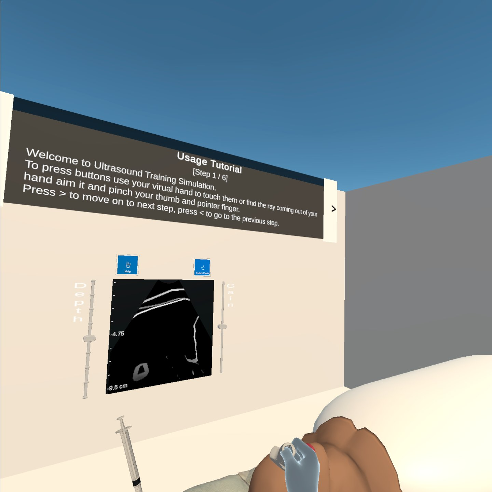

## 1. Ultrasound Training Simulation

Created with advisement from Dr. Steven Feiner, Dr. Robert Maniker, and Dr. David Kessler

## 2. Authors

Manxueying Li
ml4529@columbia.edu

Lior Tal
ljt2136@columbia.edu

Chengchen Li
cl4021@columbia.edu

Ziyao Zhang
zz2790@columbia.edu

Jacob Alexander
jla2206@columbia.edu

## 3. Date of submission

December 31 2021

## 4. Development platform(s)

Unity 2019.4.16.f1.

## 5. Mobile platforms, OS versions, and device names (and server platform, if any)

Oculus Quest

## 6.Project title

Ultrasonic Probe Training

## 7.Project directory overview
The main scene is at: Assets/Scenes/mainScene

The scripts are at: Assets/Scripts and Assets

## 8.Special Instructions, if any, for deploying your app

Followed the Unity tutorial here: https://developer.oculus.com/documentation/unity/book-unity-gsg/.

## 9.Special instructions, if any, for preparing your targets

None.

## 10.Video URL
[YouTube Video Demo](https://m.youtube.com/watch?v=Vi_FTKmmF_0)

## 11.Missing features

None

## 12.Bugs in your code and in any system you used
No observed bugs in our code.

## 13.Asset sources

